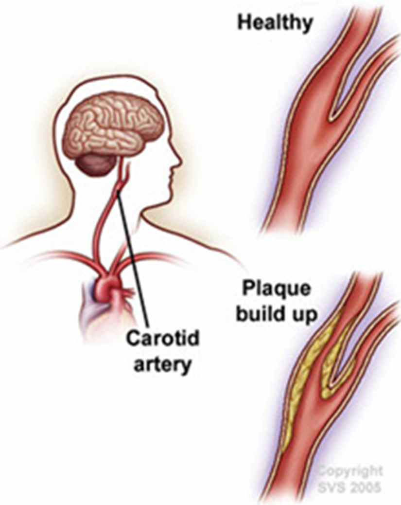
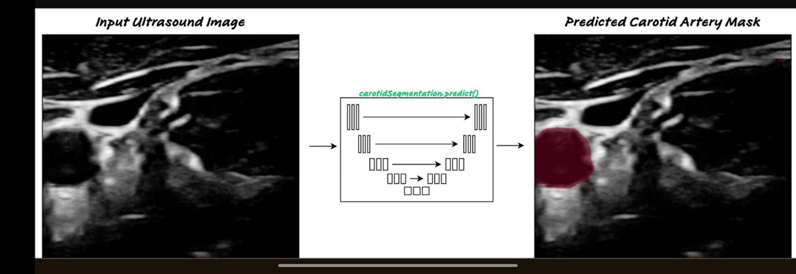
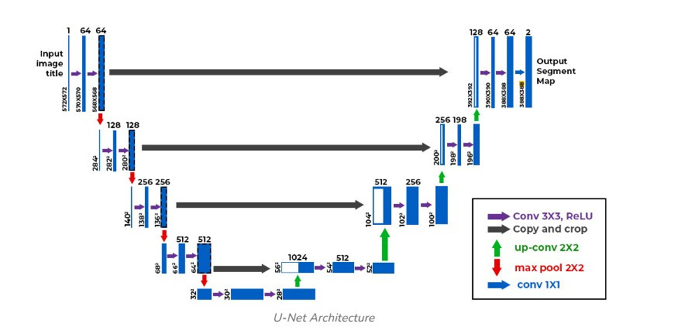
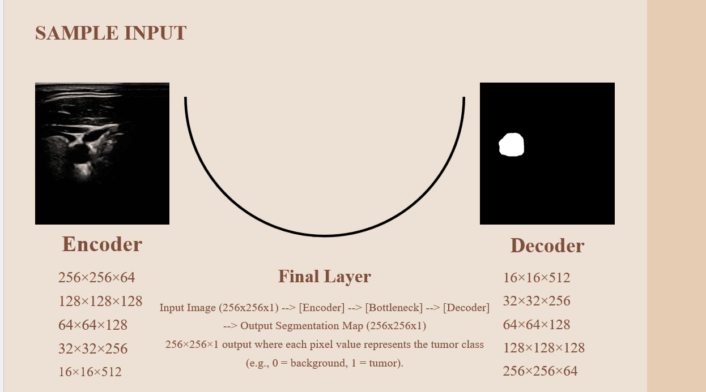
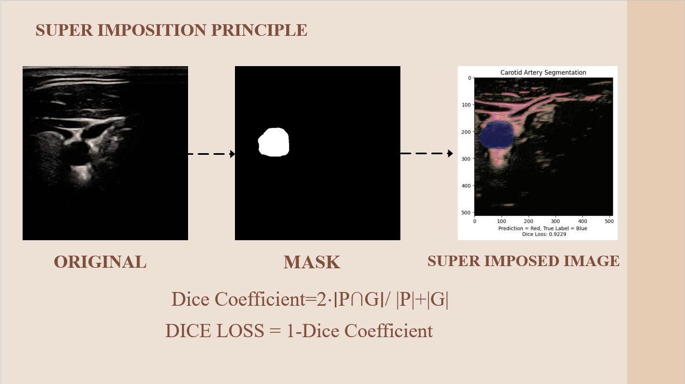
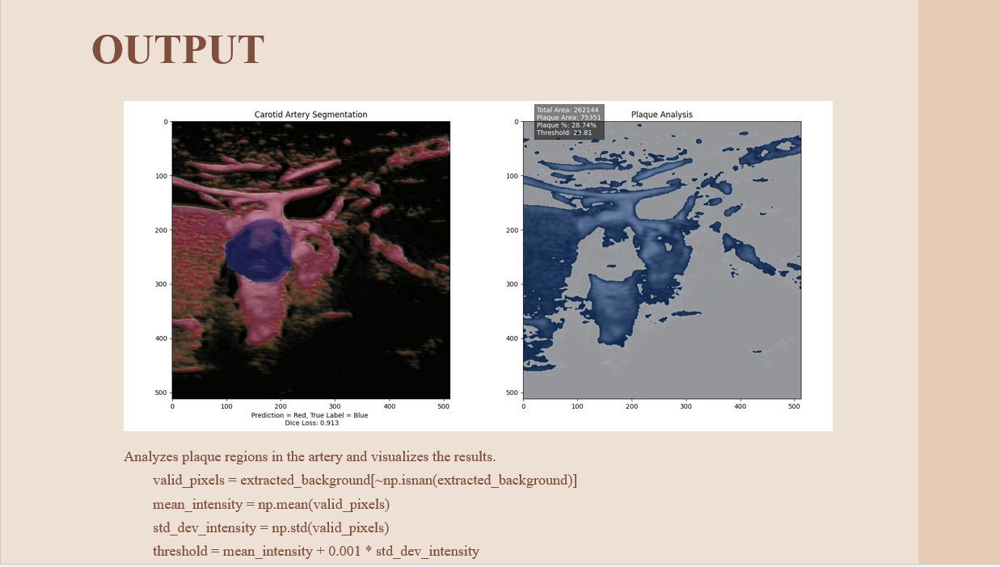

# carotid_artery_detection-_DL_model

The carotid arteries are major blood vessels in the neck that supply oxygenated blood to the brain, neck, and face.  
Internal Carotid Artery (ICA): Supplies blood to the brain.  
Found on both sides of the neck, with one artery on the left and one on the right.  
Blockages or narrowing can lead to serious conditions like stroke or clotting of blood in the brain.
Significance:
Early diagnosis and management are crucial to prevent complications.

PROBLEM STATEMENT
Develop a robust algorithm for automatic segmentation and plaque analysis in carotid artery using Deep Learning techniques for quantification of risk measurement .

U-NET ARCHITECTURE
U-Net is a deep learning model primarily used for image segmentation tasks. It is particularly well-suited for biomedical image analysis due to its ability to capture both high-resolution spatial information and contextual features.

DATASETS
link for dataset:https://data.mendeley.com/datasets/d4xt63mgjm

Sample Input:

superimposition output:

Final output:
